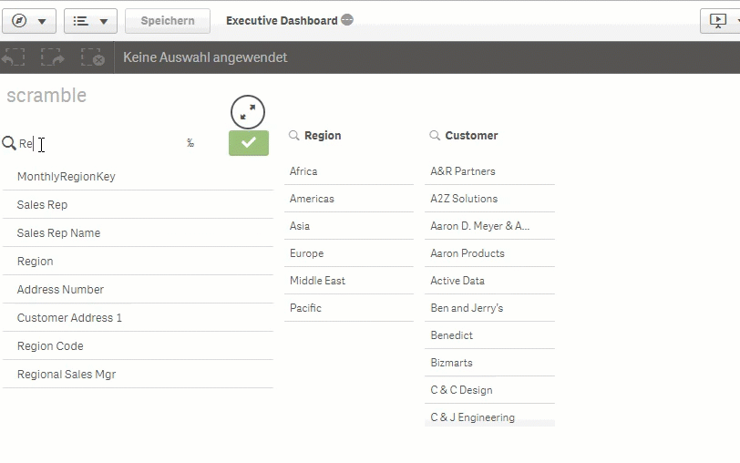

# q2g-ext-scramble

This extension was developed, to scramble fields in the datamodel of an app.

<aside class="warning">
The scramble function is not working with the actual qlik sense releases. For a workaround you have to duplicate the app after scrambling. Important is, that you do not close the session in which you have scrambled bevor duplicating the app.
</aside>

## Intro

## Settings

### Options

In the configuration options you can toggle additional fields, to show them in the list.

In the accessibillity options you can switch the use of shortcuts from the default values to customise shortcuts. The recommendation ist to use the combination of "strg + alt + {any keycode}", so that you do not get in truble with screenreaders shortcuts.

## Install

### binary

1. [Download the ZIP](https://m.sense2go.net/extension-package) and unzip
2. Qlik Sense Desktop
   Copy it to: %homeptah%\Documents\Qlik\Sense\Extensions and unzip
3. Qlik Sense Entripse
   Import in the QMC

### source

1. Clone the Github Repo into extension directory
2. Install [nodejs](https://nodejs.org/)
3. Open Node.js command prompt
4. npm install
5. npm run build
